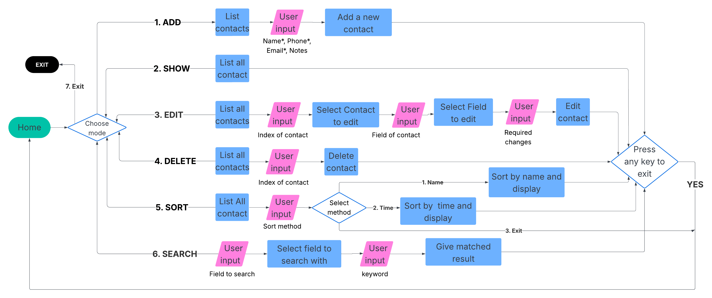

# Contact Manager Console Application - Developer Docs

## Overview
It is a C# console based contact management system that allow users to **add**, **show**, **edit**, **delete**, **sort**, and **search** contacts. 

---

## Control flow

---

## Important Components

### 1. **Console UI**
Handles user interaction and operates using two main function sets

#### Service Functions
- These manage higher level operations using user inputs from utility functions
- It has the the access to users contact list data and methods.
  - `ManageAddContact()` – adds a new contact to the list
  - `ManageShowContact()` – display all contacts
  - `ManageEditContact()` – edit a selected contact
  - `ManageDeleteContact()` – delete a contact
  - `ManageSortContact()` – sorts contacts alphabetically
  - `ManageSearchContact()` – searches contacts by field

#### Utility Functions
- These handle direct user input and repetitive tasks:
- Input functions: `GetName()`, `GetEmail()`, `GetPhone()`, `GetNotes()`, `GetField()`, `GetOptions()`
- These input function also validates, extra validations can be added here which will applied through out entire app.
- Repetitive console helper functions : `PrintHeader()`, `HandleExit()`, etc.

---

### 2. **ContactList Class**
Create and manages the main list of contactsData and provides core operations

- `AddContact()` – Adds a contact object to the list
- `GetContacts()` – Return the entire list
- `ShowContact()` – Prints details of a single contact
- `ShowContacts()` – Prints all contacts
- `ShowContactByIndex()` – Prints contact at a specific index
- `EditContact()` – Updates contact based on index, field and key to change
- `DeleteContact()` – Removes selected contact from list
- `Search()` – Searches contacts by field with keyword
- `SortContacts()` – Sorts the contact list alphabetically

---

### 3. **ContactData Class**
Is a single contact with the following attributes
- `Name`
- `Phone`
- `Email`
- `Notes`

---
## Folder Structure
This is the folder structure of the components discussed above
- `/Contact Manager`
  - `Program.cs`
  - `ContactData.cs`
  - `ContactListData.cs`
  - `ConsoleUI/`
    - `Services.cs`
    - `Utilities.cs`
---
