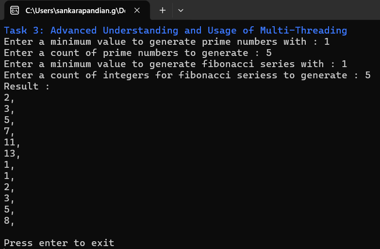

# Async/Await, Task Parallel Library, and Multi-Threading in C# 


### Task 1: Understanding and Implementing Async/Await

- This task will get a valid url from the user and displays the user with the content fetched from that url.
- I have created `HttpContentFetcher` that have method to fetch the content from url it also return error message if it can't fetch.

### Task 2: Implementing and Understanding Task Parallel Library 

- In this task I have used parallel foreach and sequential foreach and compared it performance with processing time.
- Parallel for each was faster than the sequential one.


### Task 3: Advanced Understanding and Usage of Multi-Threading 

- In this task i have created two methods to generate prime numbers and Fibonacci series
- Each run will run in different threads and finally single combined list of both results will be displayed to user.



### Task 4: Implementing Multi-Layered Async/Await Operations in a Real-World Scenario 

- In this task I have implemented a simple tool that gets a summary of longest word in the file
- I was asked to implement three methods
- Method A (Should do time consuming operation) - I have implemented a method which will read a file and separate every words in it and return the longest word in it.
- Method B (Should make a request with a url constructed by result of method A) - I have implemented the method to construct a url of Wikipedia api to get the summary of the longest word returned by methodA
- Method C (Parses the result) - I have implemented a method to get the summary data from the Json returned from request.
- All this method are async operations and the result will be printed at console for the user
- Here is the screen recording of this task where i gave a path of file with word 'csharp'

<video width="320" height="240" controls>
  <source src="./Assets/ScreenRecordings/Task4ScreenRecording.mp4" type="video/mp4">
</video>

### Task 5: Debugging and Fixing Deadlock Conditions 

- This task is to find where the deadlock happening in given code and how to prevent it.

```cs
public async Task DeadLockMethod()
{
    var result = SomeAsyncOperation().Result;
    Console.WriteLine(result);
}
public async Task<string> SomeAsyncOperation()
{
    await Task.Delay(1000);
    return "Hello, World";
}
```

- In console apps this code runs well because it doesn't have any UI synchronization context as the console itself a separate component.
- But in app like WPF we have synchronization context to keep the UI thread always updated
- So if we use this same code in WPF like apps it will cause deadlock
- At line 3 `SomeAsyncOperation` is called with `.Result` so here main thread will be waiting for the result. So **main thread is blocked here**.
- Inside `SomeAsyncOperation`, Task delay will be run on another thread.
- When the task delay ends, the remaining lines needs the main thread to execute it. **Here is where deadlock happens**.
- To prevent it we should use await while calling `SomeAsyncOperation` wont block the main thread and allows it to execute remaining lines in caller method.

```cs
// This code won't cause deadlock
public async Task DeadLockMethod()
{
    var result = await SomeAsyncOperation();
    Console.WriteLine(result);
}
public async Task<string> SomeAsyncOperation()
{
    await Task.Delay(1000);
    return "Hello, World";
}
```

### Task 6: Real-World Application of ConfigureAwait in a Console Application with Thread Tracking 

- In this task i have implemented a tool to find the total number of words in a file.
- I was asked to implement two methods
- Method A (Should do a long running operation) : I have created a method that read content from a file.
- Method B (Should call MethodA, await its result, and then performs some further processing ) - I have created a method to get the counts of words in the content read from a file using method A.
- I have used `ConfigureAwait(false)` to call the method A so that it wont need the continuation does not have to be run on the original context.


### Task 7: Understanding the Difference between Async Void and Async Task with Exceptions

- In this task I have implemented an async void method and async task method that throws an exception.
- Here the exception thrown by task method can be caught outside but unable catch the exception thrown by void method.
- This is because exception is stored in the task while void have no place to store.
- This stored exception will be caught when it is awaited or we can get it later using result or wait.

> ## Errors handled
> - I have validated a url
>  - I have validated the file path
>    - Invalid characters check
>    - .txt extension check
>    - Root path check
>    - File extension check
> - File handling
>     - Inform user if file is opened by other process or any exception caught while readin the file
