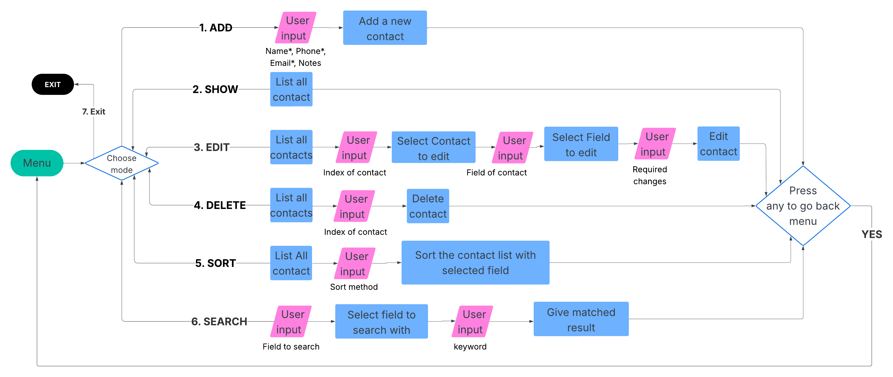
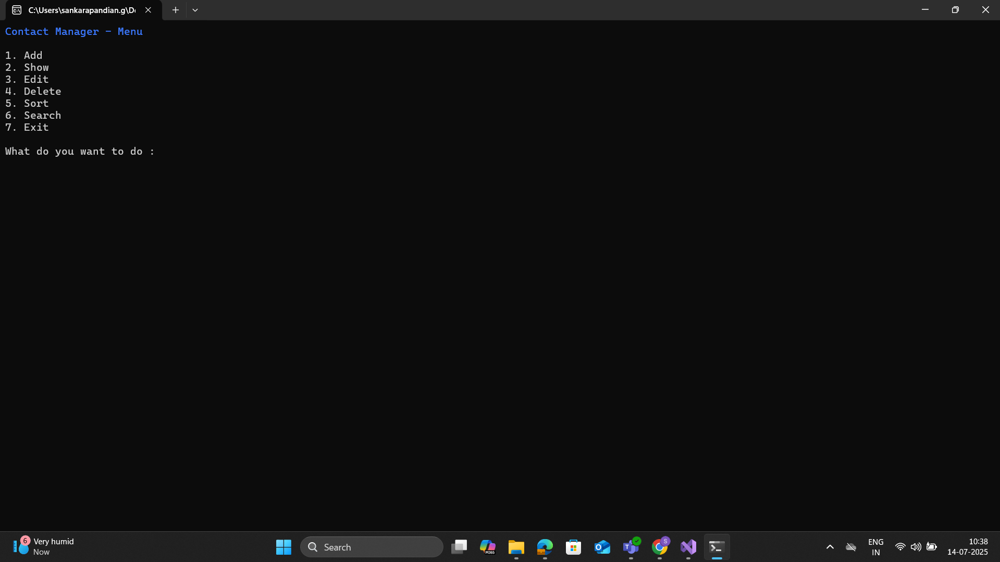

# Contact manager - User guide

When you launch the app, you can see a menu with options of 
- Add
- Show
- Edit
- Delete
- Sort
- Search
- Exit

## Working Flow Chart

## Add Contact
**Purpose :** Add a new contact.
- You will be prompted to enter name*, email*, phone* and additional notes.
- After entering all the required field you can save contact.
- After viewing it you can exit back to home.

## Show Contact
**Purppose :** View all save contacts.
- The app will list you all the contacts as a table.
- After viewing it you can exit back to home.

## Edit contact
**Purpose :** Edit the saved contacts.
- You will be shown all the saved contacts.
- You can select the index of contat to edit, field to edit and the change you want.
- After editing it you can exit back to home.
  
## Delete contact
**Purpose :** Delete the saved contact.
- You will be shown all the saved contacts.
- You can select the index of contat to delete.
- After deleting you can exit back to home.

## Sort contact
**Purpose :** Sort the saved contacts.
- You will be shown all the sorting options (name, time).
- Selected optino will be applied to entire app.

## Search contact
**Purpose :** Edit the saved contacts.
- You can select the field to search, and the keyword.
- You will be shown all the matched results.

## Edit contact
**Purpose :** Close the app.

## Screenshot of menu

