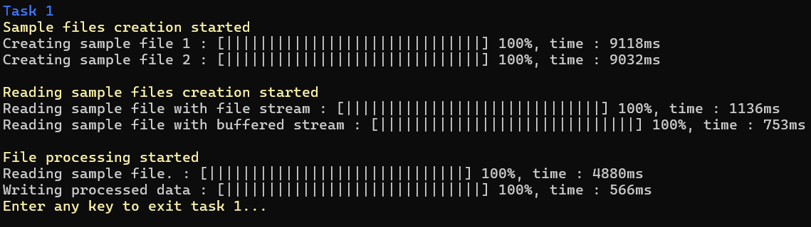
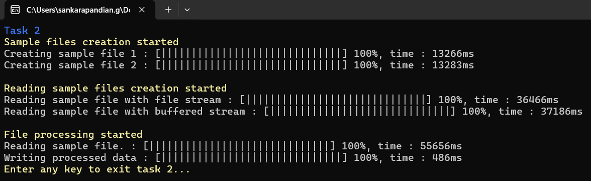

## Working with file stream

#### Task 1

- I have implemented a method to create sample machine data files with random recording for specified file size.
- I have tried to read the generated sample file with file stream and buffered stream.
- Buffered stream is more efficient as it reduces the OS calls.
- Then I have tried to process the data from the file, here i have filtered the lower temperature data.
- Then I have wrote this in memory stream which stores the data inside the heap, it is efficient to write smaller data as writing small data directly into file is costly than the writing inside a memory.
- Then copied the data in memory stream to a file via file stream finally.

#### Task 2

- I have implemented all the function in the task with asynchronous method.
- Here I have added a custom progress bar to observe that the asynchronous methods are happening in concurrently or parallelly.
- Async methods took some more time due to context switching.

#### Task 3
In this task I have optimized the given code
- optimizations :
- I have removed the memory stream as we are directly writing to the file which reduces unnecessary overhead
- Removed the for loop that calling console methods because that reduces the performance, instead directly printed the value in one stretch.
- I have increased the buffer size, which may help if we try to write more number of data in future.
- I have used buffered stream to read which will reduces the number of OS calls.

#### Task 4
In this task I have optimized the given code
- Fix : Message parameter haven't used, instead the previous code snippet written empty data into file.
- I have implemented the lock() to enforce thread safety while more number of threads tries to the same resources.
- To enable multiuser logging, I have created individual error lo files for every user."# gb" 

> ## Error handling
- Path given by user are validated
	- Path should not have invalid characters.
	- Path must not be relative.
	- File existence will be checked.
	- Only text files are supported
- As asynchronous process involved, file operations on a file that already used by other process is restricted.

> ## Additional things

I have created the progress bar UI component which can be used as both static for synchronous process and dynamic for
asynchronous where currently running progress bar will move to top of the console when user moves to other pages.

This is how the progress bar works for synchronous processes

<video width="320" height="240" controls>
  <source src="./Assets/Videos/SyncScreenRecording.mp4" type="video/mp4">
</video>

This is how the progress bar works for asynchronous processes

<video width="320" height="240" controls>
  <source src="./Assets/Videos/AsyncScreenRecording.mp4" type="video/mp4">
</video>