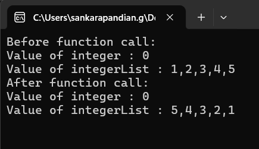
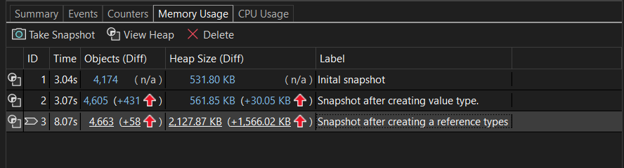
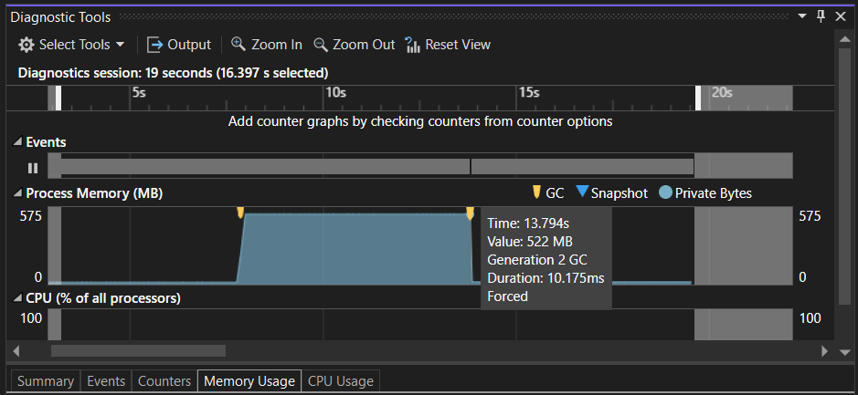
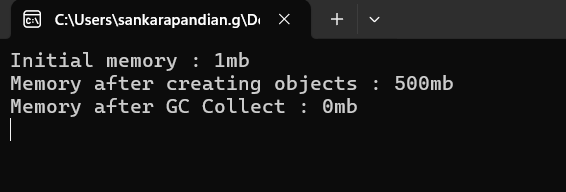

# Memory management

## My insights

### Task 1

It demonstrates the copying behaviour of the value and reference types. A value type and reference type were defined at main function and passes to a method which will change the value of it. It will change the value type integer to 1 and sort the reference type integer list in descending order.



**Inference :** The value type are copied as value so when it passed to a method it was actually duplicated in the method scope so, when it got changed by a method it doesn't reflected in main scope.

Reference type was copied by reference so when it is passed to the method, it still points to the data stored at heap. So when the method changes it via reference it was reflected in main method scope too.

---

### Task 2

It demonstrates where the value and reference types are stored, how stack and heaps works under the hood. We have two methods where one method create some number of value types and another one create a large number of reference types data. Both memory and locals of call stack frame were observed after executing each methods


Value type function : 

```csharp
private void CreateValueTypes()
{
    decimal a = 1;
    decimal b = a + 1;
    decimal c = b + 1;
    decimal d = c + 1;
    decimal e = d + 1;
    decimal f = e + 1;
    decimal g = f + 1;
    decimal h = g + 1;
    decimal i = h + 1;
    decimal j = i + 1;
    j--;
}
```

Reference type function :

```csharp
private void CreateReferenceTypes()
{
    decimal[] integerArray = new decimal[100000];
    for (int count = 0; count < 100000; count++)      
    {
        integerArray[count] = count++;
    }
}
```



**Inference :** When the first function called there isn't a huge difference in heap size as every data was directly stored in stack frame.

When the second function called, heap size increased and only the reference was stored at stack frame.

---

### Task 3

Demonstrates how garbage collection works and its impact in application process. I have called a method which will create a specified amount of data in mb in heap and dereference it followed by a forced GC call. The heap memory is monitored through out entire execution.




**Inference :** The heap size has increased by 500mb from the intial stage after creating the objects. Which remained same even after derefrencing until forced GC collect. After the forced GC collect, decrease in heap memory is observed.

---

### Task 4

Demonstrate the purpose of the IDisposable interface and how 'using' statement is used to automatically dispose the objects. I have created a custom file writer which inherits from IDisposable with a contract to have Dispose method. I have created a stream writer object inside the custom file writer, and disposed the stream writer object in dispose method. Used this file writer in main method with the using statement.

**Inference :** After creating the file writer object and used it to write a file. I have tried to read that file with a new stream reader object without calling the dispose method of the file writer. But it worked wihout any error as I used the file writer object inside the using statement, the dispose method was automatically called after the end of its scope.