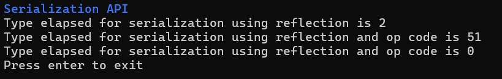

# Reflections

In this assignment, I have learned about the use of reflection and applied it through the tasks provided. I 
have developed this as a single console app, which accepts plugins for each task. 

- The main app provides all the required methods to interact with the user, form handler, utilities, and assembly helpers.
- `IUserInterface` provides methods to interact with the user.
- `FormHandlers` provide methods to get assembly-related information from the user, like path, type, properties, arguments, etc. It also allows filters to restrict users from asking for unsupported types.
- `AssemblyHelper` provides methods to handle assembly-related things like loading an assembly, invoking a method, and creating an instance.
- It also provides a template for a task plugin through the interface `ITask`; each task class implementing `ITask` represents a subtask from an assignment, which can be added as a plugin to the main app.
- Plugins can only use all the service classes provided by the main app; they can't create any service classes outside the task type.

## Task 1: Inspect Assembly Metadata 

- This plugin allows users to view all the information about the assembly.
- User can load a valid `.dll` file once by giving its path.
- After the plugin loads, the assembly user can view all the info by selecting the type and which kind of members they want to view.
- User’s can view fields, methods, properties, events of any type.
- They can also view the values of properties if the type can be instantiated (not static, abstract, and has a constructor or generic parameters).

## Task 2: Dynamic Object Inspector

- This plugin allows users to view the properties of any supported types.
- User can load a valid `.dll` file once by giving its path.
- After the plugin loads the assembly the user can view all the properties of any supported types.
- Allows the user to set a value for the property by dynamically creating an instance for that type.
- In this plugin, user can set string, decimal, and any primitive typed properties.

## Task 3: Dynamic Method Invoker

- This plugin allows users to invoke supported methods of any type in assembly.
- User can load a valid `.dll` file once by giving its path.
- After the plugin loads the assembly, user can view all the methods and can invoke them by selecting supported methods.
- In this plugin user can invoke any method that may asks for arguments with a primitive type, decimal, or string.

## Task 4: Dynamic Type Builder

- This plugin allows users to create limited types, and properties, and methods for it dynamically.
- The user should provide the name for the class, property, and a string value for it.
- The user should also provide a name for the methods that will print the property value set by the user in the console.

## Task 5: Plugin System

In this task, I was asked to develop a plugin-like app, which provides a common interface for plugins, and 
a plugin can use that interface to develop it. The main app should load `.dll` files and run all these plugins at runtime via reflections.

I have developed this entire assignment in this way, here each task is considered as a separate plugin, which will be loaded at runtime from the main app.

## Task 6: Mocking Framework

- In this task, I have created a dynamic type builder for the `ICalculator` interface.
- This task was not added as a separate plugin, as it is not a tool.
- I have added this task to the main project with some testing methods.
- I have also added an N unit testing for this dynamic built type.

## Task 7: Serialization API

- This task was also added to the main project
- This task demonstrates the limitations and advantages of reflection and reflection emit
- It performs serialization with a timer to see the performance difference
- When using just reflection, it took some time to serialize every time
- But when using emit with op codes, it only took more time on first time, and for further serialization, the results were way faster.

