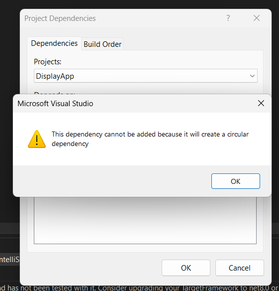
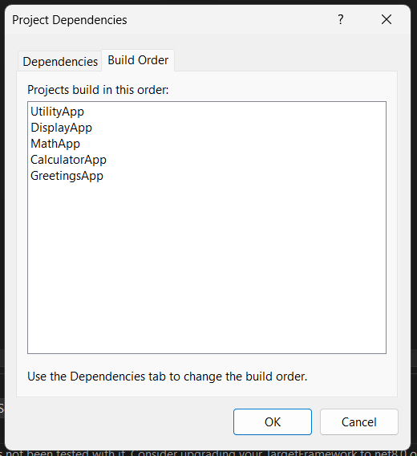

# Importance of proper project organization, solution management, and build order in C# development.

- Seperation of projects according to its purpose.
- Reusabilty : We can reuse the project codes wherever we need them just by adding it as a dependency.
- Sln file can be used to group the projects together, manage the dependencies and build order and other configurations.
- Correct build order ensures that dependent projects are compiled in sequence, avoidin errors.

# Issue faced : Circular dependency

While implementing the assignment, I have encountered an circular dependency between MathApp and DisplayApp
- MathApp had DisplayApp as dependency.
- DisplayApp needed to use the functionalities from MathApp.

# Solution : Dependency injection

We should change the build order to solve the issue, but as the assignment asks to maintain the same build order we can still solve this using dependency injection.
- Created an interface in DisplayApp representing the Math class.
- MathApp implement this interface, exposing its functionality.
- DisplayApp uses dependency injection to access the implementation math interface from MathApp.

The final build order : 

